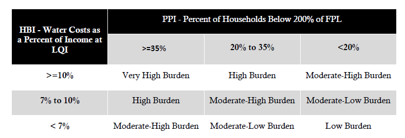
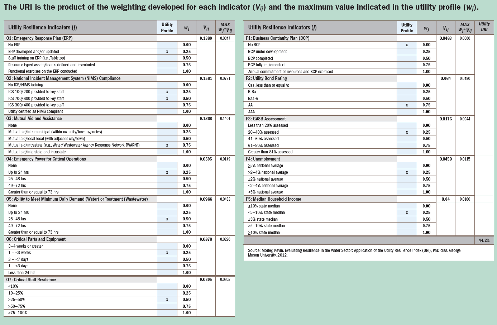

```{r setup, include=FALSE}
knitr::opts_chunk$set(echo = TRUE)
library(tidyverse)
library(sf)
library(webshot)
library(tidycensus)
library(mapview)
library(leafsync)
library(esri2sf)
library(plotly)
library(ggthemes)
```

## Potential Water Equity Lens indicators

### Pillar 1: Access: Affordability, and Water Quality 

Pillar 1 focuses on access to affordable and high quality water and sewer services. 


#### Quality of service

* Proportion of households that have been affected by at least 1 service interruption

  - Source: Utility records

* Proportion of households that have been affected by at least 1 boil water advisory

  - Source: Utility records. County public health departments

* Proportion of households that have been affected by at least 1 health-based SDWA violation 

  - Source: SDWIS/ State DEQ + Utlity information about service area portion relevant.

#### Affordability

The ideal affordability measure would be the proportion of households in the service area for whom the annual expenditures on water and sewer services (net of any customer assistance program subsidies) exceeded some threshold percent value of their annual income, which could be tailored to neighborhoods based on cost of living. However, without household-level data, or even detailed cross-tabulations of household income and size, such a measure is impossible to calculate with a reliable degree of accuracy.

 - Source: Utility rate structures. US Census ACS 5-year (Places, Tracts, Block Groups)
 
##### Approach 0: % MHI

This is the conventional, if outdated metric. We use the median income of the Census Place, or the household count-weighted average median income of Census Tracts as the denominator. We use the utility-reported "average water bill" for the numerator.

##### Approach 1: HBI/PPI Matrix


This approach was developed for AWWA, NACQA, and WEF. It is elaborated in [this report](../literature/DevelopingNewFrameworkForAffordabilityReport.pdf) 



The LQI could be calculated from the Census statistic for the relevant Census Place, or when inapplicable, from household count-weighted averages of the upper limit of the 20th percentile of household income within Census Tracts or Block Groups. 

Basic water/sewer cost is taken from assuming a "basic services" level of consumption in terms of gallons per capita per day (generally 50), and a representative household size.

The PPI could be similarly taken from the relevant Census Place, or household count-weighted averages of the value within constituent Census Tracts or Block Groups of the service area. 

An issue with even this simplified metric is it makes a fundamental point assumption about the household size of households in the lower income quintile that is unknowable for publicly available Census Geographies other than Public Use Microdata Areas, which can only be representative for a small number of large-city utilities. 

However, its 4-level qualitative scale could be easily converted into a color scale/gage/stoplight, and is easily calculated from US Block Group level data. 

##### Approach 2: Ratio of aggregate basic water service bills to aggregate income for the bottom quintile. 

In order to make the affordability metric less dependent on an unreliable point estimate of household size, the figure can instead be calculated as
the ratio of total basic water/sewer costs to total income (B19025) from households under the 20th (for overall area) percentile of income  (B19082), assuming the distribution of household size is similar for the lower quintile of household income as the entire distribution of income. Alternatively could calculate this distribution from any intersecting PUMAs. 

That is, from the U.S. Census, we procure the count of households in the service area of each household size from 1 to 7+ persons. We then assign to each household a monthly consumption corresponding to 50 GPCD, and calculate the resulting water and sewer bill according to the utility rate structure. 

We then calculate the LQI as in Approach 1. Based on the household income bracket counts, we estimate the number of households with incomes below the community-wide bottom income quintile upper limit in each tract. We then sum up the basic water/sewer bills in each tract, and divide by the aggregate income of the bottom quintile of household income. 

* Supplement: Calculate this figure, but subtracting the value of any CAP subsidies from the numerator. 
* Supplement: Proportion of HH cut off due to nonpayment at least once/twice last year (by tract)

### Pillar 2: Workforce and Economic Development Benefits

* Number Staff living in service area/tract

* Aggregate pay/benefits accruing to staff living within service area/ tract (???)

* Diversity requirements in hiring

* Diversity requirements in procurement

* Local requirements for procurement/contracting

* Participation in local education, training and workforce development programs
  - Binary
  - Trainees engaged with

### Pillar 3: Resilience and Investment

#### Planning and Assessment

* Number Community water planning meetings (in each Tract)

* Proportion of community water planning meeting attendance (per tract)

* Utility Resilience Index (URI e.g. acute disasters) 

 - Perhaps omitting the Unemployment and Median income indicators, which could be redundant with Pillar 1. 
 - Perhaps adding in variable for Drought/ Water Shortage contingency plan

#### Infrastructure Conditions

* Proportion structures with lead service lines (by tract)

* Water main breaks/length pipe (by tract)

* Sewer overflows (by tract)

* Infrastructure Leakage Index (by DMA -> summarize over Census Tract if possible)

* Water quality complaints received/ addressed (by tract)

#### Asset management investments

- Lead service line replacements (proportion of lead service lines by tract)

- Number leaks detected (by tract)

- Expenditure incurred for detection measures

- Infrastructure repair/rehabilitation/replacement expenditure (by tract) 

- Real losses reduced due to repairs/rehab/replacement (by tract)


## Source data

In this section, we procure any raw real-world source data, and save in GeoJSON format in the `/data` directory. In this case, the real-world source data comes from the [U.S. Census American Community Survey 5-year Data API](https://www.census.gov/data/developers/data-sets/acs-5year.html), the [Naperville Geographic Open Data Portal](https://map-naperville.opendata.arcgis.com), or the [Naperville Water and Wastewater Utility website](https://www.naperville.il.us/services/water-utility/)

### Service area boundary

For the purposes of this exercise, we take the service area boundary to be the municipal boundary of the City of Naperville, IL. Note that in a real-world context, we would want to use the actual service area boundary, which can cross municipal boundaries. This is particularly important due to situations where multiple utilities serve one municipality, including areas that differ socioeconomically. It is also important in situations where utilities charge different rates to customers depending on which municipality (or unincorporated area) they are located within.

```{r,  fig.keep=1, results="asis"}
# boundary_url <- "https://opendata.arcgis.com/datasets/8ae0f0fd2f854bc184ce61c56d140585_0.geojson"
# boundary <- sf::read_sf(boundary_url)
# sf::st_write(boundary,"../cache/boundary.geojson")
# boundary <- sf::read_sf("../cache/boundary.geojson")
# sf::st_write(boundary,"../data/boundary.geojson")
boundary <- sf::read_sf("../data/boundary.geojson")
map <- mapview::mapview(boundary,
                        alpha.regions=0,
                        stroke=TRUE,
                        color="blue",
                        lwd=2,
                        layer.name="Naperville, IL Boundary")
map
```

### Census

Here we procure Census Tract and Block group information
```{r, include=FALSE, echo=FALSE, message=FALSE}
tidycensus::census_api_key("b25f8b1b7bf10561c9cbc3a20a4d2572677f1f05")
options(tigris_use_cache = TRUE) 
```

```{r, results="hide", warning=FALSE, message=FALSE, eval=FALSE}
#tidycensus::census_api_key("key goes here") #set census API key
vars <- tidycensus::load_variables(2019, "acs5", cache = TRUE) # download all possible variables

#set list of variables to pull for tracts/ block groups
cv <- c(pop_race_count = "B01001_001",
        pop_race_white = "B02001_002",
        pop_race_black = "B02001_003",
        pop_race_american_indian_native_alaskan = "B02001_004",
        pop_race_asian = "B02001_005",
        pop_race_native_hawaiian_pacific_islander = "B02001_006",
        pop_race_other_race = "B02001_007",
        pop_race_two_or_more_races = "B02001_008",
        pop_hispanic = "B03002_012",
        pop_hispanic_white_alone = "B03002_013",
        pop_travel_time_work_count = "B08012_001",
        pop_travel_time_work_less_5min = "B08012_002",
        pop_travel_time_work_5_9min = "B08012_003",
        pop_travel_time_work_10_14min = "B08012_004",
        pop_travel_time_work_15_19min = "B08012_005",
        pop_travel_time_work_20_24min = "B08012_006",
        pop_travel_time_work_25_29min = "B08012_007",
        pop_travel_time_work_30_34min = "B08012_008",
        pop_travel_time_work_35_39min = "B08012_009",
        pop_travel_time_work_40_44min = "B08012_010",
        pop_travel_time_work_45_59min = "B08012_011",
        pop_travel_time_work_60_89min = "B08012_012",
        pop_travel_time_work_atleast_90min = "B08012_013",
        hh_type_total_count = "B11016_001",
        hh_type_family_count = "B11016_002",
        hh_type_family_size_2 = "B11016_003", 
        hh_type_family_size_3 = "B11016_004", 
        hh_type_family_size_4 = "B11016_005", 
        hh_type_family_size_5 = "B11016_006", 
        hh_type_family_size_6 = "B11016_007", 
        hh_type_family_size_7more = "B11016_008", 
        hh_type_nonfamily_count = "B11016_009",
                 hh_type_nonfamily_size_1 = "B11016_010",
                 hh_type_nonfamily_size_2 = "B11016_011", 
                 hh_type_nonfamily_size_3 = "B11016_012", 
                 hh_type_nonfamily_size_4 = "B11016_013", 
                 hh_type_nonfamily_size_5 = "B11016_014", 
                 hh_type_nonfamily_size_6 = "B11016_015", 
                 hh_type_nonfamily_size_7more = "B11016_016", 
                 pop_educ_attainment_count = "B15003_001",
                 pop_educ_none = "B15003_002",
                 pop_educ_nursery = "B15003_003",
                 pop_educ_kindergarten = "B15003_004",
                 pop_educ_grade1 = "B15003_005",
                 pop_educ_grade2 = "B15003_006",
                 pop_educ_grade3 = "B15003_007",
                 pop_educ_grade4 = "B15003_008",
                 pop_educ_grade5 = "B15003_009",
                 pop_educ_grade6 = "B15003_010",
                 pop_educ_grade7 = "B15003_011",
                 pop_educ_grade8 = "B15003_012",
                 pop_educ_grade9 = "B15003_013",
                 pop_educ_grade10 = "B15003_014",
                 pop_educ_grade11 = "B15003_015",
                 pop_educ_grade12_nodiploma = "B15003_016",
                 pop_educ_HSdiploma = "B15003_017",
                 pop_educ_GED = "B15003_018",
                 pop_educ_college_less_1year = "B15003_019",
                 pop_educ_college_more_1year_nodegree = "B15003_020",
                 pop_educ_assoc = "B15003_021",
                 pop_educ_bachelor = "B15003_022",
                 pop_educ_master = "B15003_023",
                 pop_educ_prof = "B15003_024",
                 pop_educ_doc = "B15003_025",
                 families_poverty_status_count = "B17026_001",
                 families_poverty_inc_ratio_less_0.5 = "B17026_002",
                 families_poverty_inc_ratio_0.5_0.74 = "B17026_003",
                 families_poverty_inc_ratio_0.75_0.99 = "B17026_004",
                 families_poverty_inc_ratio_1.0_1.24 = "B17026_005",
                 families_poverty_inc_ratio_1.25_1.49 = "B17026_006",
                 families_poverty_inc_ratio_1.5_1.74 = "B17026_007",
                 families_poverty_inc_ratio_1.75_1.84 = "B17026_008",
                 families_poverty_inc_ratio_1.85_1.99 = "B17026_009",
                 families_poverty_inc_ratio_2_2.99 = "B17026_010",
                 families_poverty_inc_ratio_3_3.99 = "B17026_011",
                 families_poverty_inc_ratio_4_4.99 = "B17026_012",
                 families_poverty_inc_ratio_5_over = "B17026_013",
                 hh_income_count = "B19001_001",
                 hh_income_less_10k = "B19001_002",
                 hh_income_10k_15k = "B19001_003",
                 hh_income_15k_20k = "B19001_004",
                 hh_income_20k_25k = "B19001_005",
                 hh_income_25k_30k = "B19001_006",
                 hh_income_30k_35k = "B19001_007",
                 hh_income_35k_40k = "B19001_008",
                 hh_income_40k_45k = "B19001_009",
                 hh_income_45k_50k = "B19001_010",
                 hh_income_50k_60k = "B19001_011",
                 hh_income_60k_75k = "B19001_012",
                 hh_income_75k_100k = "B19001_013",
                 hh_income_100k_125k = "B19001_014",
                 hh_income_125k_150k = "B19001_015",
                 hh_income_150k_200k= "B19001_016",
                 hh_income_200k_more = "B19001_017",
                 hh_wage_salary_income_count = "B19052_001",
                 hh_wage_salary_income_with = "B19052_002",
                 hh_wage_salary_income_without = "B19052_003",
                 hh_public_assistance_count = "B19058_001",
                 hh_public_assistance_with = "B19058_002",
                 hh_public_assistance_without = "B19058_003",
                 median_hh_income = "B19013_001",
                 pop_in_hh_with_income_assistance = "B09010_002",
                 pop_in_hh_with_no_income_assistance = "B09010_008",
                 per_capita_income = "B19301_001",
                 pop_employment_count = "B23001_001",
                 pop_employment_male_count = "B23001_002",
                 pop_employment_male_labor_force_16_19_count = "B23001_004",
                 pop_employment_male_labor_force_16_19_unemployed = "B23001_008",
                 pop_employment_male_labor_force_20_21_count = "B23001_011",
                 pop_employment_male_labor_force_20_21_unemployed = "B23001_015",
                 pop_employment_male_labor_force_22_24_count = "B23001_018",
                 pop_employment_male_labor_force_22_24_unemployed = "B23001_022",
                 pop_employment_male_labor_force_25_29_count = "B23001_025",
                 pop_employment_male_labor_force_25_29_unemployed = "B23001_029",
                 pop_employment_male_labor_force_30_34_count = "B23001_032",
                 pop_employment_male_labor_force_30_34_unemployed = "B23001_036",
                 pop_employment_male_labor_force_35_44_count = "B23001_039",
                 pop_employment_male_labor_force_35_44_unemployed = "B23001_043",
                 pop_employment_male_labor_force_45_54_count = "B23001_046",
                 pop_employment_male_labor_force_45_54_unemployed = "B23001_050",
                 pop_employment_male_labor_force_55_59_count = "B23001_053",
                 pop_employment_male_labor_force_55_59_unemployed = "B23001_057",
                 pop_employment_male_labor_force_60_61_count = "B23001_060",
                 pop_employment_male_labor_force_60_61_unemployed = "B23001_064",
                 pop_employment_male_labor_force_62_64_count = "B23001_067",
                 pop_employment_male_labor_force_62_64_unemployed = "B23001_071",
                 pop_employment_male_labor_force_65_69_count = "B23001_074",
                 pop_employment_male_labor_force_65_69_unemployed = "B23001_076",
                 pop_employment_male_labor_force_70_74_count = "B23001_079",
                 pop_employment_male_labor_force_70_74_unemployed = "B23001_081",
                 pop_employment_male_labor_force_75_above_count = "B23001_084",
                 pop_employment_male_labor_force_75_above_unemployed = "B23001_086",
                 pop_employment_female_count = "B23001_088",
                 pop_employment_female_labor_force_16_19_count = "B23001_090",
                 pop_employment_female_labor_force_16_19_unemployed = "B23001_094",
                 pop_employment_female_labor_force_20_21_count = "B23001_097",
                 pop_employment_female_labor_force_20_21_unemployed = "B23001_101",
                 pop_employment_female_labor_force_22_24_count = "B23001_104",
                 pop_employment_female_labor_force_22_24_unemployed = "B23001_108",
                 pop_employment_female_labor_force_25_29_count = "B23001_111",
                 pop_employment_female_labor_force_25_29_unemployed = "B23001_115",
                 pop_employment_female_labor_force_30_34_count = "B23001_118",
                 pop_employment_female_labor_force_30_34_unemployed = "B23001_122",
                 pop_employment_female_labor_force_35_44_count = "B23001_125",
                 pop_employment_female_labor_force_35_44_unemployed = "B23001_129",
                 pop_employment_female_labor_force_45_54_count = "B23001_132",
                 pop_employment_female_labor_force_45_54_unemployed = "B23001_136",
                 pop_employment_female_labor_force_55_59_count = "B23001_139",
                 pop_employment_female_labor_force_55_59_unemployed = "B23001_143",
                 pop_employment_female_labor_force_60_61_count = "B23001_146",
                 pop_employment_female_labor_force_60_61_unemployed = "B23001_150",
                 pop_employment_female_labor_force_62_64_count = "B23001_153",
                 pop_employment_female_labor_force_62_64_unemployed = "B23001_157",
                 pop_employment_female_labor_force_65_69_count = "B23001_160",
                 pop_employment_female_labor_force_65_69_unemployed = "B23001_162",
                 pop_employment_female_labor_force_70_74_count = "B23001_165",
                 pop_employment_female_labor_force_70_74_unemployed = "B23001_167",
                 pop_employment_female_labor_force_75_above_count = "B23001_170",
                 pop_employment_female_labor_force_75_above_unemployed = "B23001_172",
                 housing_units_count = "B25002_001",
                 housing_units_vacant = "B25002_003",
                 housing_units_occuped = "B25002_002",
                 pop_units_count = "B25033_001",
                 pop_owner_occupied_units = "B25033_002",
                 pop_rental_units = "B25033_008",
                 hh_size_avg_overall = "B25010_001",
                 hh_size_avg_owner = "B25010_002",
                 hh_size_avg_renter = "B25010_003",
                 housing_unit_median_year_built_overall = "B25035_001",
                 housing_unit_median_year_built_owner = "B25037_002",
                 housing_unit_median_year_built_renter = "B25037_003",
                 housing_units_plumbing_count = "B25050_001",
                 housing_units_plumbing_complete = "B25050_002",
                 rent_median = "B25058_001",
                 rent_quartile_upper = "B25059_001",
                 rent_quartile_lower = "B25057_001",
                 renters_count = "B25069_001",
                 renters_all_utilities_included = "B25069_003",
                 renters_not_all_utilities_included = "B25069_002",
                 median_gross_rent_percent_hh_income = "B25071_001",
                 home_value_lower_quartile = "B25076_001",
                 home_value_median = "B25077_001",
                 home_value_upper_quartile = "B25078_001",
        hh_inc_rent_count = "B25074_001",
        hh_inc_less_10k_rent_count = "B25074_002",
        hh_inc_less_10k_rent_less_20perc = "B25074_003",
        hh_inc_less_10k_rent_20_24.9perc = "B25074_004",
        hh_inc_less_10k_rent_25_29.9perc = "B25074_005",
        hh_inc_less_10k_rent_30_34.9perc = "B25074_006",
        hh_inc_less_10k_rent_35_39.9perc = "B25074_007",
        hh_inc_less_10k_rent_40_49.9perc = "B25074_008",
        hh_inc_less_10k_rent_more_50perc = "B25074_009",
        hh_inc_less_10k_rent_notComputed = "B25074_010",
              hh_inc_10k_19.9k_rent_count = "B25074_011",
        hh_inc_10k_19.9k_rent_less_20perc = "B25074_012",
        hh_inc_10k_19.9k_rent_20_24.9perc = "B25074_013",
        hh_inc_10k_19.9k_rent_25_29.9perc = "B25074_014",
        hh_inc_10k_19.9k_rent_30_34.9perc = "B25074_015",
        hh_inc_10k_19.9k_rent_35_39.9perc = "B25074_016",
        hh_inc_10k_19.9k_rent_40_49.9perc = "B25074_017",
        hh_inc_10k_19.9k_rent_more_50perc = "B25074_018",
        hh_inc_10k_19.9k_rent_notComputed = "B25074_019",
              hh_inc_20k_34.9k_rent_count = "B25074_020",
        hh_inc_20k_34.9k_rent_less_20perc = "B25074_021",
        hh_inc_20k_34.9k_rent_20_24.9perc = "B25074_022",
        hh_inc_20k_34.9k_rent_25_29.9perc = "B25074_023",
        hh_inc_20k_34.9k_rent_30_34.9perc = "B25074_024",
        hh_inc_20k_34.9k_rent_35_39.9perc = "B25074_025",
        hh_inc_20k_34.9k_rent_40_49.9perc = "B25074_026",
        hh_inc_20k_34.9k_rent_more_50perc = "B25074_027",
        hh_inc_20k_34.9k_rent_notComputed = "B25074_028",
              hh_inc_35k_49.9k_rent_count = "B25074_029",
        hh_inc_35k_49.9k_rent_less_20perc = "B25074_030",
        hh_inc_35k_49.9k_rent_20_24.9perc = "B25074_031",
        hh_inc_35k_49.9k_rent_25_29.9perc = "B25074_032",
        hh_inc_35k_49.9k_rent_30_34.9perc = "B25074_033",
        hh_inc_35k_49.9k_rent_35_39.9perc = "B25074_034",
        hh_inc_35k_49.9k_rent_40_49.9perc = "B25074_035",
        hh_inc_35k_49.9k_rent_more_50perc = "B25074_036",
        hh_inc_35k_49.9k_rent_notComputed = "B25074_037",
              hh_inc_50k_74.9k_rent_count = "B25074_038",
        hh_inc_50k_74.9k_rent_less_20perc = "B25074_039",
        hh_inc_50k_74.9k_rent_20_24.9perc = "B25074_040",
        hh_inc_50k_74.9k_rent_25_29.9perc = "B25074_041",
        hh_inc_50k_74.9k_rent_30_34.9perc = "B25074_042",
        hh_inc_50k_74.9k_rent_35_39.9perc = "B25074_043",
        hh_inc_50k_74.9k_rent_40_49.9perc = "B25074_044",
        hh_inc_50k_74.9k_rent_more_50perc = "B25074_045",
        hh_inc_50k_74.9k_rent_notComputed = "B25074_046",
              hh_inc_75k_99.9k_rent_count = "B25074_047",
        hh_inc_75k_99.9k_rent_less_20perc = "B25074_048",
        hh_inc_75k_99.9k_rent_20_24.9perc = "B25074_049",
        hh_inc_75k_99.9k_rent_25_29.9perc = "B25074_050",
        hh_inc_75k_99.9k_rent_30_34.9perc = "B25074_051",
        hh_inc_75k_99.9k_rent_35_39.9perc = "B25074_052",
        hh_inc_75k_99.9k_rent_40_49.9perc = "B25074_053",
        hh_inc_75k_99.9k_rent_more_50perc = "B25074_054",
        hh_inc_75k_99.9k_rent_notComputed = "B25074_055",
         hh_inc_more_100k_rent_count = "B25074_056",
        hh_inc_more_100k_rent_less_20perc = "B25074_057",
        hh_inc_more_100k_rent_20_24.9perc = "B25074_058",
        hh_inc_more_100k_rent_25_29.9perc = "B25074_059",
        hh_inc_more_100k_rent_30_34.9perc = "B25074_060",
        hh_inc_more_100k_rent_35_39.9perc = "B25074_061",
        hh_inc_more_100k_rent_40_49.9perc = "B25074_062",
        hh_inc_more_100k_rent_more_50perc = "B25074_063",
        hh_inc_more_100k_rent_notComputed = "B25074_064",
        hh_income_aggregate = "B19025_001",
        hh_income_aggregate_share_Q1 = "B19082_001",
        hh_income_aggregate_share_Q2 = "B19082_002",
        hh_income_aggregate_share_Q3 = "B19082_003",
        hh_income_aggregate_share_Q4 = "B19082_004",
        hh_income_aggregate_share_Q5 = "B19082_005",
        hh_income_aggregate_share_Top5 = "B19082_006",
        hh_income_upper_limit_Q1 = "B19080_001",
        hh_income_upper_limit_Q2 = "B19080_002",
        hh_income_upper_limit_Q3 = "B19080_003",
        hh_income_upper_limit_Q4 = "B19080_004",
        hh_income_lower_limit_Top5 = "B19080_005",
        inc_poverty_count = "C17002_001",
        inc_poverty_count_gr2 = "C17002_008"
        
        
                 )

## Download all counties, and ifnd counties that intersect the boundary
counties <- tidycensus::get_acs(year=2019,
                                geography = "county",
                                variables = "B01001_001",
                                geometry = TRUE)  %>% 
  sf::st_transform(4326) %>%
  dplyr::filter(lengths(sf::st_intersects(., boundary)) > 0)

# Find FIPS code for relevant state and counties, make sure no duplicates
st <- unique(substr(counties$GEOID,1,2)) 
ct <- unique(substr(counties$GEOID,3,5))

# Get data for census tracts intersecting the boundary, having first gotten only
# tracts from the state/county the boundary intersects


tracts.w <- tidycensus::get_acs(year=2019,
                              geography = "tract",
                              variables = cv,
                              geometry = TRUE,
                              state = st,
                              county = ct,
                              output="wide") %>% 
  sf::st_transform(4326) %>%
  dplyr::filter(lengths(sf::st_intersects(., boundary)) > 0)

tracts.l <- tidycensus::get_acs(year=2019,
                              geography = "tract",
                              variables = cv,
                              geometry = TRUE,
                              state = st,
                              county = ct) %>% 
  sf::st_transform(4326) %>%
  dplyr::filter(lengths(sf::st_intersects(., boundary)) > 0)


 st_write(tracts.w,"../data/tracts_wide.geojson", append=FALSE)
 write.csv(st_drop_geometry(tracts.w),"../data/tracts_wide.csv")
 
 
 st_write(tracts.l,"../data/tracts_long.geojson", append=FALSE)
 write.csv(st_drop_geometry(tracts.l),"../data/tracts_long.csv")

# Get data for census block groups intersecting the boundary, having first gotten only
# block groups from the state/county the boundary intersects

bg.w <- tidycensus::get_acs(year=2019,
                          geography = "block group",
                          variables = cv,
                          geometry = TRUE,
                          state = st,
                          county = ct,
                          output="wide") %>% 
  sf::st_transform(4326) %>%
  dplyr::filter(lengths(sf::st_intersects(., boundary)) > 0)

bg.l <- tidycensus::get_acs(year=2019,
                          geography = "block group",
                          variables = cv,
                          geometry = TRUE,
                          state = st,
                          county = ct) %>% 
  sf::st_transform(4326) %>%
  dplyr::filter(lengths(sf::st_intersects(., boundary)) > 0)

st_write(bg.w,"../data/blockgroups_wide.geojson", append=FALSE)
write.csv(st_drop_geometry(bg.w),"../data/blockgroups_wide.csv")


st_write(bg.l,"../data/blockgroups_long.geojson", append=FALSE)
write.csv(st_drop_geometry(bg.l),"../data/blockgroups_long.csv")

pl.w <- tidycensus::get_acs(year=2019,
                          geography = "place",
                          variables = cv,
                          geometry = TRUE,
                          state = st,
                          output = "wide")  %>% 
  sf::st_transform(4326) %>%
  dplyr::filter(GEOID == 1751622)

pl.l <- tidycensus::get_acs(year=2019,
                          geography = "place",
                          variables = cv,
                          geometry = TRUE,
                          state = st)  %>% 
  sf::st_transform(4326) %>%
  dplyr::filter(GEOID == 1751622)

st_write(pl.w,"../data/place_wide.geojson", append=FALSE)
write.csv(st_drop_geometry(pl.w),"../data/place_wide.csv")

st_write(pl.l,"../data/place_long.geojson", append=FALSE)
write.csv(st_drop_geometry(pl.l),"../data/place_long.csv")


```

The data can be further manipulated and visualized, for example, below we compare the % of the population that is White with the median year built of residential structures in Census Tracts and Census Block groups that intersect the Naperville boundary. In the example comparison, nonwhite populations are spatially correlated with newer building stock. Indicators for the Equity Lens Pillars should probably account for several different axes of infrastructure access. Some notable features of these maps: 

1. Both block groups and tracts may be suitable units of analysis, depending on the community and the degree of spatial granularity with which spatial socioeconomic segregation may exist. In some areas, using tracts obscures large differences in the percentage of the population that is white at the block group level, for instance. 

1. Service area or municipal boundaries do not map neatly onto census geographies, so assumptions need to be made about how to weight census-geography level attributes.


```{r, include=FALSE, echo=FALSE}

bg.w <- sf::read_sf("../data/blockgroups_wide.geojson")
tracts.w <- sf::read_sf("../data/tracts_wide.geojson")
boundary <- sf::read_sf("../data/boundary.geojson")

bg.w$perc_white = 100*bg.w$pop_race_whiteE/bg.w$pop_race_countE
tracts.w$perc_white = 100*tracts.w$pop_race_whiteE/tracts.w$pop_race_countE

bg.w$housing_unit_median_year_built_overallE[which(bg.w$housing_unit_median_year_built_overallE==0)] <-NA

tracts.w$housing_unit_median_year_built_overallE[which(tracts.w$housing_unit_median_year_built_overallE==0)] <-NA

```

```{r, results="asis", echo=FALSE, message=FALSE}
bg.white.map <- mapview(select(bg.w,perc_white),
                        zcol="perc_white",
                        layer.name="% Pop. White </br> Census Block Groups") + 
  mapview(boundary,
          layer.name="Naperville Boundary",
          col.regions="red",alpha.regions=0,
          stroke=TRUE, color="red", lwd=2)

tracts.white.map <- mapview(select(tracts.w,perc_white),
                            zcol="perc_white",
                            layer.name="% Pop. White </br> Census Tracts") + 
  mapview(boundary,
          layer.name="Naperville Boundary",
          col.regions="red",alpha.regions=0,
          stroke=TRUE, color="red", lwd=2)

bg.yearbuilt.map <- mapview(select(bg.w,housing_unit_median_year_built_overallE),
                        zcol="housing_unit_median_year_built_overallE",
                        layer.name="Median Year Built </br> Census Block Groups") + 
  mapview(boundary,
          layer.name="Naperville Boundary",
          col.regions="red",alpha.regions=0,
          stroke=TRUE, color="red", lwd=2)

tracts.yearbuilt.map <- mapview(select(tracts.w,housing_unit_median_year_built_overallE),
                        zcol="housing_unit_median_year_built_overallE",
                        layer.name="Median Year Built </br> Census Tracts") + 
  mapview(boundary,
          layer.name="Naperville Boundary",
          col.regions="red",alpha.regions=0,
          stroke=TRUE, color="red", lwd=2)

sync(bg.white.map,tracts.white.map,bg.yearbuilt.map,tracts.yearbuilt.map)
```

### Utility data

#### Water (& sewer) rates

See here: [https://www.naperville.il.us/waterrates](https://www.naperville.il.us/waterrates) Below, we write a function that takes as function the volume in gallons consumed in 1 month and returns the total water and sewer bill at current rates, assuming a 5/8" residential meter, and calculate the complete volume-bill curve

```{r rates, results="asis"}
calculate_bill <- function(volume = 6000){
  fixed_charges = 7.63 + 9.85 + 1.8
  vol_rate = 5.76 + 2.71 
  bill = fixed_charges+ (vol_rate*volume)/748.052
  return(bill)
}

volume <- seq.int(from = 0, to = 20000, by = 100)
bill <- calculate_bill(volume) 
bill <- data.frame(cbind(volume,bill))

p <- ggplot(data=bill, aes(x=volume,y=bill)) + 
  geom_line() +
  theme_tufte(base_size=18) + 
  ylab('Monthly Water and Sewer Bill (USD)') + 
  xlab('Monthly water consumption (gallons)') 
ggplotly(p)

```

#### Lead service lines

Many utilities will have conducted lead line surveys as part of lead line identification and replacement programs. In this case, Naperville has parcel-level data, shown below.

```{r, echo=FALSE, message=FALSE, results="asis"}
# lead_line_url <- "https://opendata.arcgis.com/datasets/945218b0377a481284203d8839d1cab4_0.geojson"
# lead_lines <- sf::read_sf(lead_line_url)
# sf::st_write(lead_lines,"../data/parcels_lead_service_lines.geojson",append=FALSE)
lead_lines <- sf::read_sf("../data/parcels_lead_service_lines.geojson")
#mapview::mapview(lead_lines, zcol="CONFIRMED_LEAD_SERVICE")

```

#### Pipe network

ESRI Provides the water pipe network layers for Naperville. These can be used to simulate pipe break and water quality testing data. 

```{r, results="asis"}
# mains <- esri2sf("https://sampleserver6.arcgisonline.com/arcgis/rest/services/Water_Network/MapServer/16")
# st_write(mains,"../data/mains.geojson",append=FALSE)
mains <- sf::read_sf("../data/mains.geojson")
mains <- mains[boundary,op=st_intersects] 

# laterals <- esri2sf("https://sampleserver6.arcgisonline.com/arcgis/rest/services/Water_Network/MapServer/17")
# st_write(laterals,"../data/laterals.geojson",append=FALSE)
# laterals <- sf::read_sf("../data/laterals.geojson")
# laterals <- laterals[boundary,op=st_intersection]
  
sample_stations <- esri2sf("https://sampleserver6.arcgisonline.com/arcgis/rest/services/Water_Network/MapServer/7")
samp <- sample_stations[boundary,op=st_intersects] 
ids <- sample(sample_stations$objectid,size=50)
samp <- samp %>% filter(objectid %in% ids)


mapview(boundary,alpha.regions=0,col.regions="black",stroke=TRUE,color="black",lwd=3) + mapview(mains,color="blue") + mapview(samp,col.regions="red",color="red",layer.name="Sample Locations")

```
